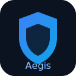

# Aegis GRC Guard

A modern, multi-tenant GRC platform that centralizes risks, controls, policies, evidence, and reporting to accelerate audit readiness.

## Value Proposition
- Unifies GRC work across teams in one intuitive workspace.
- Eliminates spreadsheet chaos with structured workflows and real-time status.
- Speeds up SOC 2 and ISO 27001 readiness with built-in controls, evidence, and approvals.

## Core Features & Capabilities
- Risk Register: create, update, accept/mitigate, and track history.
- Controls Management: owners, status, effectiveness, and evidence association.
- Evidence Library: upload/replace, approvals, expiration tracking, and reviewer flow.
- Policies: versioning, approvals, exceptions, and attestation campaigns.
- Tasks: assignments, due dates, progress tracking, and “My Tasks” views.
- Reporting: exportable dashboards for risks, compliance, evidence health, and more.
- Audit Logs: every key action captured for traceability.
- Role-Based Access: Admin, Manager, Viewer.
- Organization Isolation: strict multi-tenant separation.

## Target Audience & Use Cases
- SaaS startups planning or maintaining SOC 2.
- Mid-market teams standardizing ISO 27001 programs.
- Internal audit, risk, and compliance leaders needing centralized visibility.
- Use Cases: audit preparation, control testing, evidence management, policy lifecycle, attestation tracking, exceptions handling.

## Screenshots

<!-- Screenshot Guidelines
  - Store images under docs/screenshots/
  - Recommended size: 1280x800 PNG or JPG
  - File naming: <section>.png (e.g., dashboard.png)
  - Keep sensitive data out of screenshots
-->

## Integrations & Supported Platforms
- Identity & Access: Google and Azure SSO.
- Data & Storage: Supabase (Auth, Postgres, Storage).
- Billing: Stripe support for plan management.
- Hosting: Vercel-ready deployments.
- Exports: CSV/PDF reporting.

## Testimonials & Outcomes
- Faster audit readiness and reduced manual tracking.
- Clear audit trails and approvals improve reviewer confidence.

## Live Demo & Trials
- Live Demo: https://aegis-grc.vercel.app
- Request Trial: open an issue titled “Request Trial” on this repository.

## Branding
- Logo: `public/aegis-logo.svg`
- Primary color: `#4f46e5`
